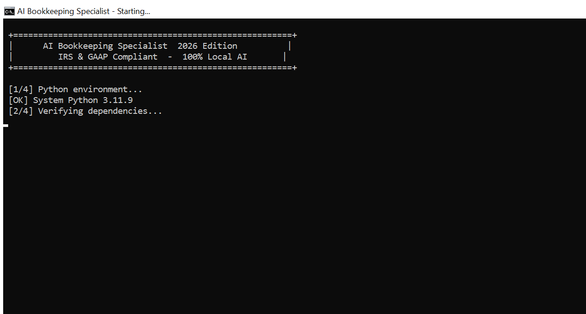

# AI Bookkeeping Specialist — 2026 Edition

> Audit-Ready Financials. Zero Cloud Risk. Built for CPAs and Small Business Owners.

---

## Table of Contents

1. [Why Use This App](#why-use-this-app)
2. [Quick Start](#quick-start)
   - [One-Click Launch (Recommended)](#one-click-launch-recommended)
   - [Manual Launch](#manual-launch)
3. [LinkedIn Landing Page](#linkedin-landing-page)
4. [How to Use the AI Tax Auditor](#how-to-use-the-ai-tax-auditor)
5. [System Requirements](#system-requirements)
6. [License](#license)

> For full operational details, troubleshooting, and the Receipt Vault guide see [USER_GUIDE.md](USER_GUIDE.md).

---

## Why Use This App

### The Value Proposition for Small Business Owners

Most small business owners do one of three things with their bookkeeping:

1. Pay a CPA $200-$400/hour to review transactions after the fact
2. Use QuickBooks Online ($30-$200/month) and hope the automated categorization is right
3. Ignore it until tax season -- then panic

All three share the same problem: **nobody is checking whether your expenses will survive an IRS audit until it is too late.**

The IRS does not care that you forgot a receipt. They do not care that your bookkeeping software said the transaction looked fine. They care about the rules -- and the rules are specific.

---

### Here is What That Costs You in Real Money

| Situation | What Happens |
|---|---|
| You expense a $300 business dinner with no receipt | IRS disallows it under section 274. You owe taxes on $300 + penalties + interest. |
| You buy a $5,000 laptop and expense it in full | GAAP says it should be capitalized. Your P&L is overstated. |
| You run a product business and do not apply UNICAP | You have been under-reporting inventory costs. Section 263A adjustment owed. |
| You deduct 100% of meals | Legal limit is 50%. You have overstated deductions every year. |

These are not edge cases. They are the four most common audit triggers for Schedule C filers -- and they happen to businesses that are doing everything else right.

---

### AI Bookkeeping Specialist Catches All of This Before Your CPA Does

Every transaction you import gets reviewed by three AI agents simultaneously:

- **IRS Agent** -- checks the $75 receipt threshold, deductibility rules, and section 274 substantiation requirements on every line item
- **GAAP Agent** -- flags expenses over $2,000 that should be capitalized as assets instead of expensed
- **UNICAP Agent** -- identifies inventory and production costs subject to section 263A uniform capitalization rules

You get a plain-English verdict on every transaction: Cleared, Flagged, or Capitalize? -- with the exact IRS code cited. Not a vague warning. The actual rule.

---

### What This Means for Your Business

You stop finding out about problems when the IRS letter arrives. You find out on Tuesday morning, when you import your bank statement -- before the return is filed, before penalties accrue, before anything is permanent.

You also stop paying your CPA to do the audit work you could have done yourself. When you walk into a CPA office with a ledger already reviewed by three compliance agents, flagged transactions documented, and a Schedule C worksheet pre-filled -- you are paying for their signature, not their time.

---

### It Runs on Your Machine. Not Ours.

Your financial data never leaves your computer. No cloud sync. No monthly SaaS subscription per client. No vendor with access to your books. SHA-256 hashing makes the ledger tamper-evident. The AI model runs locally via Ollama.

---

### The Bottom Line

> A one-time $299 setup covers the cost of catching a single disallowed deduction that would have triggered an IRS notice. Every year after that costs less than one hour of CPA time.

**Pricing:** $299 one-time setup / $49.99/month / 14-day free trial, no credit card required.

---

## Quick Start

### One-Click Launch (Recommended)



Double-click **`launch_bookkeeper.bat`** in the project folder.

It handles everything automatically:

- Detects and activates your Python virtual environment (or uses system Python)
- Verifies all dependencies via `requirements.txt`
- Starts Ollama if it is not already running
- Frees port 8501 if occupied
- Opens the app in your browser automatically

On first run it also creates an **AI Bookkeeper** shortcut on your Desktop with a custom icon so you can launch the app from there going forward.

### Manual Launch

```
1. Install Ollama from https://ollama.ai and pull the model:
   ollama pull llama3.2:1b

2. Install dependencies:
   pip install -r requirements.txt

3. Run:
   streamlit run maker.py
```

Then open http://localhost:8501 in your browser.

---

## LinkedIn Landing Page

[`linkedin.html`](linkedin.html) is a standalone authority page built for LinkedIn marketing campaigns.

**What it covers:**

| Pillar | Focus |
|---|---|
| Data Sovereignty | 100% local AI, SHA-256 ledger integrity, zero cloud exposure |
| Agentic Audit | IRS §274 vs. GAAP ASC 360 vs. UNICAP §263A — three-agent debate |
| Audit-Shield | Automated receipt flagging, Schedule C/E output, 7-section PDF |

**Key design decisions:**
- No pricing — pure capability and authority positioning
- Single CTA: **Request Private Demo Access** (opens a pre-filled email to `moussdiop240@gmail.com`)
- Same Midnight Finance design system as the main landing page
- Fully self-contained — no dependencies, works offline

Open locally by double-clicking `linkedin.html`, or deploy it to any static host.

---

## How to Use the AI Tax Auditor

### What It Is

The AI Tax Auditor (called Agentic Debate in the pipeline) runs three independent compliance agents against every transaction in your active client ledger. Each agent applies a different standard and works in parallel.

Navigate to it via the sidebar: Agentic Debate

---

### Before You Start

You need two things in place:

1. A client loaded -- click Client Management, select a client, click Load Client
2. Ledger data imported -- at least one transaction via Ingestion or AI Categorization

---

### Running the Audit

Navigate to Agentic Debate. The audit runs automatically on page load -- no button to click. Every transaction in the ledger is processed immediately.

---

### Reading the Results

Each transaction produces a verdict card with four fields:

**Verdict Badge**

| Badge | Meaning |
|---|---|
| CLEARED | Transaction passes this agent standard. No action needed. |
| FLAGGED | Transaction fails or is at risk. Action required before filing. |
| CAPITALIZE? | Transaction may need to be recorded as an asset, not an expense. |
| ADJUST | UNICAP uniform capitalization adjustment estimated. |

**Confidence Score**
A percentage showing how certain the agent is. Low confidence = get professional review.

**Action Line**
Exactly what to do -- for example: "Obtain receipt + written business purpose (IRC section 274(d))" or "Determine if useful life over 1 year, capitalize as asset (ASC 360)."

---

### The Three Agents Explained

**IRS Section 274 Agent** -- Receipt substantiation rules

| Amount | Verdict |
|---|---|
| $75 or less | CLEARED -- IRS safe harbor, no receipt required |
| $76 to $500 | FLAGGED (medium) -- receipt + written business purpose required |
| $501 to $1,000 | FLAGGED (high) -- elevated audit probability |
| Over $1,000 | FLAGGED (critical) -- document immediately |

What to do when flagged: Locate the receipt. If missing, reconstruct the business purpose in writing -- note the date, amount, attendees, and business reason.

---

**GAAP ASC 360 Agent** -- Capitalization threshold

| Amount | Verdict |
|---|---|
| $2,000 or less | EXPENSED -- standard period cost |
| $2,001 to $10,000 | CAPITALIZE? (medium) -- review useful life |
| Over $10,000 | CAPITALIZE? (high) -- almost certainly requires capitalization |

What to do when flagged: Ask whether this item has a useful life greater than one year. If yes -- laptop, equipment, vehicle -- it must be capitalized and depreciated, not expensed in full.

---

**UNICAP Section 263A Agent** -- Uniform capitalization rules

Only triggers on inventory, production, manufacturing, COGS, materials, resale, freight, or packaging categories. Estimates a 10% capitalization adjustment on qualifying costs over $1,000.

What to do when flagged: Review whether these costs relate to goods held for sale. If yes, a portion must be added to inventory cost. Your CPA calculates the exact adjustment at year-end.

---

### The Final Verdict

| Risk Level | Meaning |
|---|---|
| Low Risk | Fewer than 10% of transactions flagged |
| Medium Risk | 10 to 30% flagged, or high-value flags present |
| High Risk | Over 30% flagged, or critical flags present |

---

### Exporting the Results

Click Export Debate Results at the bottom of the page. Downloads a CSV with every transaction, each agent verdict, confidence score, and action line.

---

### Common Questions

**A transaction is flagged but I have the receipt -- what do I do?**
Having the receipt means you are protected. The flag is a reminder to document, not a finding that you did something wrong.

**The confidence score is 40% -- should I worry?**
Low confidence means the agent is uncertain. Get a second opinion from your CPA on those items.

**All my transactions are under $75 but I am still flagged.**
Check the GAAP and UNICAP agents -- the $75 threshold only applies to IRS section 274.

**Can I clear a flag inside the app?**
Not currently. Re-categorize the transaction in AI Categorization, then return to Agentic Debate -- the agents re-run automatically.

---

## System Requirements

| Requirement | Minimum |
|---|---|
| OS | Windows 10 or later |
| Python | 3.11+ |
| RAM | 4 GB (8 GB recommended) |
| Storage | 2 GB free (for AI model) |
| Ollama | Latest stable release |
| AI Model | llama3.2:1b (auto-downloaded by launch_bookkeeper.bat) |

---

## License

AI Bookkeeping Specialist is commercial software. A valid license key is required after the 14-day free trial.

- Setup fee: $299 one-time
- Monthly: $49.99/month
- Trial: 14 days, full access, no credit card required

Contact moustaphaleye.diop@gmail.com to purchase a license key.

2026 IRS & GAAP Compliant / SHA-256 Ledger Integrity / 100% Local